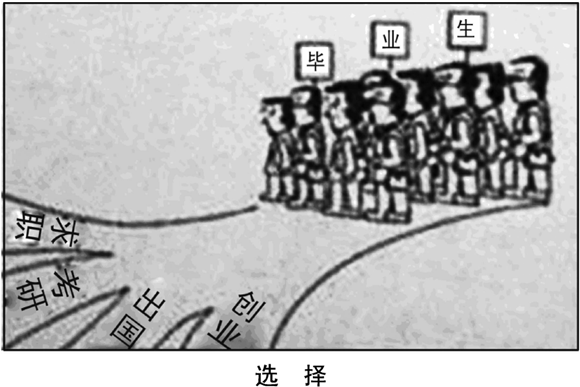
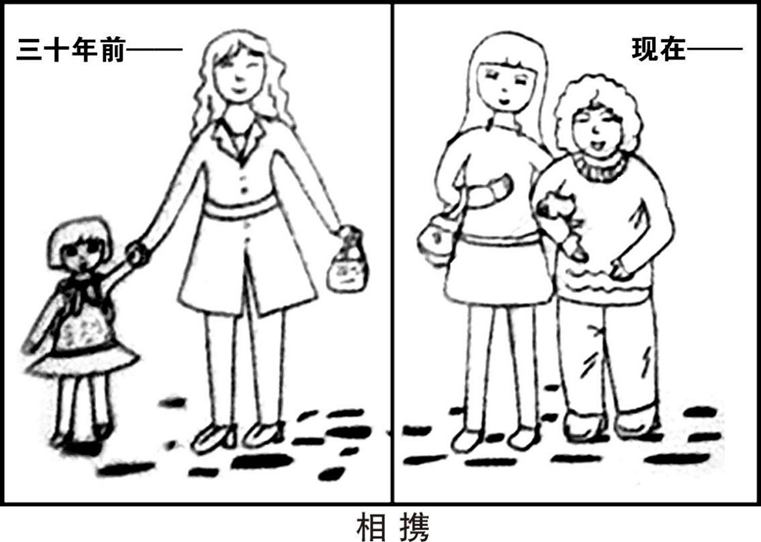

# 作文

Copyright © 2025 virtual小满 All rights reserved.
【【无广干货】六级674分作文模板（2023最新）12句，但万种组合，表达超高级！！| 四六级作文模板，四级写作模板】 https://www.bilibili.com/video/BV1zT411S7uz

## 通用高级表达

### 高级替换

| 原词 | 替换词 | 示例 |
| --- | --- | --- |
| **so**        | therefore / thus / accordingly / consequently |    |
| **very**      | extremely / remarkably / profoundly / exceedingly    |  exceedingly complex  |
| **important** | **imperative** / **indispensible** / crucial / essential / significant /vital |   |
| **many**      |  numerous / considerable / substantial  |  Doing it properly makes considerable demands on our time.(慢工出细活)  |
| **happy**    | pleased / content / delighted |   |
| **good**     | beneficial / rewarding / favorable / superior |   |
| **bad**      | **adverse** / detrimental / negative / unfavorable | negative impact / adverse effects        |
| **some**     | several / a proportion of(部分) / a handful of(少量) |   |
| **cheap**    | inexpensive / economical / cost‑efficient  |   |
| **huge**     | enormous / immense |   |
| **small**    | minor / **negligible** / insignificant / slight / modest |   |
| **think**    | consider / contemplate / contend / advocate      |   |
| **get**      | obtain / receive / acquire / attain |  receive feedback / acquire skills / attain goals |
| **start**    | commence |   |
| **show**     | demonstrate / illustrate / reveal  | reveal insights  |
| **help**     | assist / support/ facilitate |   |

Admittedly诚然

### 短句
act as the **compass** through the **storm** 骇浪倾天，司南定北
every cloud has **a silver lining** 守得云开见月明/暗幕垂天，终藏曦芒

## 谚语

### 常用谚语

> **坚持**: Constant dripping wears away the stone. 滴水穿石。
**意志**: Where there's a will, there's a way. 有志者事竟成。
**积累**: A journey of a thousand miles begins with a single step. 千里之行，始于足下。
**规划**: Well begun is half done. 好的开始是成功的一半。

### 使用示例

When obstacles seem overwhelming, remember that where there's a will, there's a way. Much like a determined climber carving out a path up a sheer cliff, we similarly can pave our own ways through challenges with **unwavering resolve**(坚定的决心).
 

## 句式

### 谈论利弊(对比)   
#### at best & at worst
##### 例句

  
> **科技利弊**: Over-reliance on artificial intelligence may achieve **superficial efficiency** at best, but at worst, it risks **eroding human cognitive engagement** and fostering **over-dependence** on automated decision-making.
 Excessive dependence on AI technologies poses risks ranging from reduced critical thinking at best to a gradual decline in independent problem-solving capacities at worst, as human agency **becomes secondary to**(次要于) algorithmic outputs.
 While AI offers practical benefits, its overuse may unintentionally discourage proactive learning and creative thinking(主动学习和创造性思维), particularly in contexts(在...环境中) requiring adaptive human judgment.
**考试**: Standardized testing is a limited tool for assessment at best and a source of excessive stress for students at worst.
**环境保护**：Relying on non-renewable resources to fulfill global energy demands **represents**, at best, **a temporary remedy** and, at worst, a **catalyst** for ecological collapse from an environmental protection perspective.(从环境保护的角度来看)

*represent*: 意味着，某事物是另一事物的典型体现，类似于signify/serves as，如分析现象本质Social media addiction represents a growing public health crisis.强调因果关系：Deforestation represents a major driver of climate change.

##### 替代表达
相当于：On the positive side..., on the negative side... ／ To some extent..., however, it might also...
> Current environmental measures(替换成作文要求的), while well-intentioned(出发点是好的), risk being ineffective **as** they inadequately target **systemic drivers** of pollution.
Current environmental measures, at best, offer partial(部分) solutions and, at worst, exacerbate existing challenges, as they inadequately address systemic drivers of pollution.(不够解决污染的系统性驱动因素)
While current environmental initiatives(倡议) demonstrate progress in certain areas, their overall efficacy(效果) **remains constrained** by insufficient attention to systemic pollution drivers.

---

## 专题

### AI

#### 词组
AI: artificial intelligence(以下文段为简洁起见均用缩写，请结合实际判断是否可以使用缩写)
interactive academic consultations 交互式学术咨询
offer unprecedented scalability in knowledge delivery在知识传递方面提供了前所未有的可扩展性

#### 真·文采句

> 📌**比喻+对比**:AI tutors function like GPS devices, providing clear directions but lacking the ability to perceive when the driver is fatigued. In contrast, human teachers act as **attentive**(贴心的) and **seasoned**(富有经验的) copilots(副驾驶员) who not only guide the journey but also recognize when a break is needed, offering support that fulfills students' emotional and cognitive needs.

#### 开头段

> 📌**机遇**: The **advent** of AI has **profoundly** reshaped campus life, influencing everything from **personalized**(个性化) study plans to AI-assisted information **retrieval**(信息检索), **thereby integrating seamlessly into**(从而无缝融入) students’ daily routines. This rapid integration presents **both unprecedented opportunities and considerable challenges**, particularly for university students preparing to enter an AI-driven world.
In today’s tech-driven era, those proficient in digital skills gain a competitive advantage in learning, careers, and social engagement, as digital competence has shifted from a complementary ability to an essential foundation for navigating modern society.

#### 主体段

##### 优势

> 📌**赋能**： AI **amplifies** human ingenuity, **transforming once-impossible visions into tangible realities.** AI放大了人类的聪明才智，将曾经不可能的愿景/构想变成了可触可及的现实。
**解放**：By automating(自动化) repetitive tasks, AI liberates(解放) us to focus on creativity and **higher-order** thinking(更高层次的思维).
**辅助**: AI serves as a tireless assistant, handling mundane(单调的) tasks and freeing human minds for creative and strategic endeavors.

##### 劣势

> **深度思考**: While AI enhances the efficiency of academic research and **permeates** everyday scholarly tasks, students must **guard against** permitting critical thinking to **yield to** algorithmic **shortcuts**(算法捷径).
📌**深度思考**: When algorithms **devour** our capacity for thought, progress sails like **a ghost ship toward mirages**. 当算法吞噬思考力，进步就像驶向海市蜃楼的幽灵船。
> **决策不透明**: Much like **navigating with a faulty compass**, the opaque decision-making processes of AI systems make it challenging to trace the origins of errors, potentially allowing mistakes to persist and **impeding**(阻碍) effective corrective measures(纠正措施).

guard against: 防止。yield to: 屈从于=give way to。permit sb to do: 允许。

#### 结尾段

> **平衡**: In conclusion, while AI has **undeniably** brought significant advancements to education, enhancing personalization and efficiency, it also presents challenges that deserve careful consideration. Therefore, it is essential for students to harness(控制并利用) the benefits of AI thoughtfully, ensuring that these tools serve to **complement** traditional learning methods rather than replace them. By maintaining a balanced approach, students can continue to develop essential critical thinking and problem-solving skills, preparing them for a future where human insight and technological advancement go hand in hand.
**会提问**: True education occurs not when machines provide answers, but when humans persistently ask better questions.

#### 示例1-以缺点为主
> [AI+教育] 定制化、即时；独立思考、情感互动、隐私、不平等。

   AI has significantly transformed education, offering numerous benefits to students. AI-powered tools provide **customized learning pathways**(定制化学习路径), enabling students to learn at their own pace and according to their individual needs. These technologies also offer immediate feedback, helping students identify and correct mistakes **promptly**(及时地). Furthermore, AI can assist in developing critical thinking skills by presenting challenging problems and scenarios that encourage analytical thinking.
   However, despite these notable(显著的/crucial) advantages, it is **imperative**(必要的) to acknowledge the potential drawbacks **accompanying** the integration of AI into education. Over-reliance on AI tools may **inadvertently**(无意间)  diminish students' capacity for independent thought and problem-solving, as dependence on automated assistance could undermine critical cognitive engagement. Additionally, AI systems **inherently**(天生地) lack emotional intelligence and human interaction, **rendering**(使得) them incapable of providing the encouragement and personalized support that human educators offer. Such interpersonal connections are essential for students' social and emotional development. 📌**Equally concerning are the privacy implications**(倒装句), **given**(因为) that AI applications often necessitate(需要) the collection and analysis of extensive personal data, thereby raising questions about privacy and data security. **Perhaps most critically**(可能最关键的是), the implementation of AI in education may exacerbate existing **inequalities**, as **disparities**(差异) in access to essential technologies and resources can hinder **equitable**(公平的) learning opportunities for all students.
   In conclusion, while AI presents promising opportunities to enhance educational quality, it is essential to **approach**(处理) its integration thoughtfully(认真地), ensuring that it **complements**(补充) traditional teaching methods and addresses the associated challenges(解决相关挑战) to provide equitable and effective education for all students.

这里倒装句是**表语前置**引起的完全倒装，表语+系动词+主语，相当于The privacy implications are equally concerning.还可以改为：Equally concerning are the privacy implications arising from AI applications, which often necessitate...
更生动的同义表达: AI systems inherently lack the human touch(人情味) — they can't offer the kind of personal encouragement a teacher gives when a student struggles, nor can they **pick up on**(注意到) **subtle cues**(细微的线索) like **a frustrated sigh or hesitant body language** to adjust their approach.

### 学习

#### 示例1-过程拆分

   To increase the likelihood of success, one should **set realistic goals** and work **persistently** towards them. **This principle holds true because** unrealistic ambitions often lead to frustration, **whereas**(但是) attainable targets foster motivation and measurable progress. Furthermore, breaking a larger goal into smaller tasks can offer **regular feedback and a sense of accomplishment**, which helps sustain enthusiasm and momentum throughout the process.
   Moreover, persistent effort **bridges the gap between goals and achievement**(架桥). For instance, a student aiming to master a complex subject within a month may feel overwhelmed; however, by breaking it into weekly milestones and receiving regular feedback, they build confidence through progressive accomplishment. This approach transforms **daunting**(令人畏惧的) tasks into manageable steps, thus sustaining motivation. Thomas Edison’s thousands of experiments before inventing the lightbulb further **exemplify how unwavering commitment transforms setbacks into stepping stones**(坚定的投入化挫折为垫脚石). Without such **resilience**, even well-designed plans **remain** unfulfilled dreams.
   Therefore, combining practical goal-setting with **unceasing** effort is essential. Only by doing so can individuals **navigate challenges**(应对挑战), reinforce progress through continual feedback, and ultimately attain truly fulfilling achievements that stand the test of time(经得起时间的考验).
   

# 真题

## 2013

### 小作文

>> Write an e-mail of about 100 words to a foreign teacher in your college, inviting him/her to be a judge for the upcoming English speech contest.

Dear Professor Mike,
    It’s a pleasure connecting with you again. Impressed by your **expertise** in public speaking, we **cordially** invite you to serve as a distinguished judge for the upcoming English Speech Contest.
    The contest is scheduled to take place on Friday, from 14:00 to 16:00, in the Grand Hall. We are honored to share that three of your students have been selected as finalists(决赛选手), reflecting the **significant strides** they have made under your **mentorship**(指导). Thanks to your dedicated instruction, they have not only strengthened their **native-level English proficiency** but also developed the confidence to 📌**articulate** their ideas **eloquently**.
    Your participation would **substantially** enhance the fairness and professionalism of the competition. We deeply appreciate your support and look forward to your **prompt**(及时的) reply.
                                                                                                                                                                                    Best regards,
                                                                                                                                                                                            Li Ming

p1: 问候语还可以使用I hope you are doing well.   /   I hope this email finds you well.
      表示因对方牛逼而邀请还可以用Given your renowned expertise in public speaking，不过这个应该用于名人(仰慕)而不是师生(真实感)，并且given有些疏离感。
p2: GPT认为不要使用Proudly/Joyfully语法，这是读后续写(描述性写作)才使用的方法(悬念/节奏感)。
p3: 可换为significantly/considerably/remarkably，不要用profoundly(更适合长期而非单次活动)/effectively(与enhance重复)/dramatically(含有突变型容易误解比赛之前不公平专业)。

### 大作文

>> Write an essay of 160-200 words based on the following drawing. In your essay, you should
1)	describe the drawing briefly,
2)	interpret its intended meaning, and
3)	give your comments.

    

        
    

Graduates at the Crossroads
    The illustration **vividly depicts** a group of graduates standing at a crossroads, confronted with multiple **divergent**(分叉的) paths labeled "job seeking", "postgraduate entrance exam", "studying abroad" and "entrepreneurship." This 📌**thought-provoking** image **reflects**/**highlights** the **diverse**(多元化的) opportunities available to contemporary graduates, yet it also **implies**/**indicates** the challenges of decision-making in an era of abundant possibilities.
    The symbolic message lies in the imperative of strategic foresight. **Following** years of academic training/cultivation, some graduates may prioritize applying knowledge through employment, while others pursue advanced degrees to **deepen their expertise**(完善专业知识). Studying abroad provides invaluable cross-cultural experiences, and entrepreneurship exemplifies/represents the courage to innovate. However, the key is not merely to choose but to **align** decisions **with**(使决策与...一致) personal aspirations and societal demands. To navigate(应对) this intricate landscape, graduates must cultivate adaptability: acquiring core competencies through rigorous scholarship, staying informed about global trends, and embracing uncertainties with resilience.
    In my perspective, the multiplicity of choices can be considered 📌**a double-edged sword**(双刃剑)/a mixed blessing(喜忧参半的事). While it empowers individuals to customize(定制) their futures, it also requires critical self-awareness. Success **hinges** not **on**(取决于) the path itself but on the dedication to thrive within it. By balancing ambition with pragmatism(务实), every graduate can transform potential into tangible achievements.

p1: depict $\to$ portray, a group of $\to$ a cohort of。
p2: stay informed about $\to$ stay attuned to $\to$ keep abreast of。

## 2014

### 小作文
>> Write a letter of about 100 words to the president  of  your  university,  suggesting how to improve students’ physical condition.

Dear President,
    I am writing to propose **feasible** strategies to improve students’ physical health, which **is integral to** their academic success and **holistic development**. Currently, sedentary(久坐不动的) lifestyles and academic pressures compromise(损害) student wellness. To address this, I recommend three initiatives.
    Firstly, **expand recreational infrastructure** by upgrading gym facilities and adding outdoor fitness zones. This would **incentivize** regular exercise. Secondly, integrate wellness into curricula through mandatory short activity breaks during lectures and incentivized physical education credits. Research confirms such interventions boost concentration and reduce stress. Lastly, partner with nutritionists to provide affordable, balanced dining options and workshops on healthy eating habits.
    Investing in preventative health measures would cultivate a resilient student body, enhancing both wellbeing and institutional reputation. I urge the university to prioritize this transformative agenda.Thank you for considering these recommendations.
                                                                                                                                                                     Yours sincerely,
                                                                                                                                                                                Li Ming

替换段：
> Firstly, integrate health education into curricula to raise awareness of preventive care, reducing long-term disease risks. Secondly, promote manageable exercise routines—such as 30-minute daily sessions—to prevent fatigue and encourage habit formation. Thirdly, utilize PE teachers' expertise by establishing mentorship programs for personalized guidance.

### 大作文
>> Write an essay of 160-200 words based on the following drawing.  In  your essay, you should
1)	describe the drawing briefly,
2)	interpret its intended meaning, and
3)	give your comments.

    

        
    

## 附录

### AI润色链接

|  | ChatGPT | DeepSeek | Kimi |
|---|---|---|---|
| 2013-小 | [gpt](https://chatgpt.com/c/681b73ac-1ad0-800f-96df-11f011dde119) | [ds](https://chat.deepseek.com/a/chat/s/62da10de-7ab3-44bd-a847-d94ded82ad59) | [kimi](https://kimi.moonshot.cn/chat/d05kte13ntnh4d1ioebg) | 
| 2013-大 | [gpt](https://chatgpt.com/c/681c1471-fb70-800f-97a5-ba323cd7364a) | [ds](https://chat.deepseek.com/a/chat/s/02de8e41-bf62-4610-9004-df6d49ba8cce) | [kimi](https://kimi.moonshot.cn/chat/d05ku9i0p58jt3v15540) |
| 2014-小 |  | [ds](https://chat.deepseek.com/a/chat/s/ce0d267c-8023-42ae-8a1d-4ae2e07d299b) | [kimi](https://www.kimi.com/chat/d12l46sbcdrvvg542q00) |
| 2014-大 | [gpt]() | [ds](https://chat.deepseek.com/a/chat/s/c6c5dacf-1b59-42de-9882-34f82699e90c) | [kimi](https://www.kimi.com/chat/d12l4u2misdut0gkr3lg) |
| AI | [gpt](https://chatgpt.com/c/683527df-f5c8-800f-b19b-d0a1559df479), [gpt](https://chatgpt.com/c/68356104-a6ec-800f-8b98-f7c3c40cf1c7) | [ds](https://chat.deepseek.com/a/chat/s/d992f989-dcc8-4aed-8721-865b04d3367d) |  |

