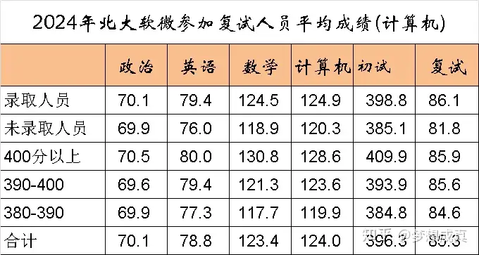
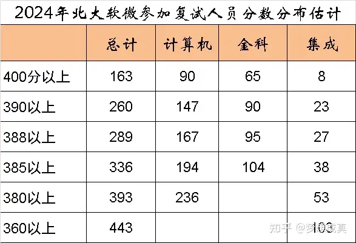
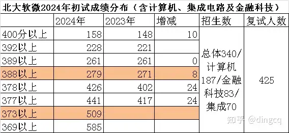

最终目标：
| 数学 | 专业课 | 英语 | 政治 | 总分 |
| ---- | ---- | ---- | ---- | ---- |
| 145 | 140 | 80 | 75 | 440 |

理想目标：
| 数学 | 专业课 | 英语 | 政治 | 总分 |
| ---- | ---- | ---- | ---- | ---- |
| 138 | 130 | 75 | 70 | 413 |

最低目标：
| 数学 | 专业课 | 英语 | 政治 | 总分 |
| ---- | ---- | ---- | ---- | ---- |
| 130 | 125 | 70 | 65 | 390 |

---

| 阶段   | 时间         | 数学目标 | 408目标 | 英语目标 | 政治目标 | 总分目标 |
|--------|--------------|----------|---------|----------|----------|----------|
| 基础期 | 3月-6月      | 110-120  | 90-100  | 65-70    | 暂不学习 | 265-290 |
| 强化期 | 7月-8月      | 120-130  | 110-120 | 70-75    | 暂不考核    | 350-380 |
| 冲刺期 | 9月-11月     | 130-140  | 120-130 | 75-80    | 65-70    | 390-420 |
| 押题期 | 12月         | 140+     | 130+    | 80+      | 70+      | 420+    |

---

以软微为例：



以下是各科目分阶段题型得分细化表：

1. 数学

| 阶段   | 选择50 | 填空30 | 大题70 | 总分目标 |
|--------|-----------------|-----------------|--------------|----------|
| 基础期 | 45-50 | 20-25 | 45-50 | 110-120  |
| 强化期 | 45-50 | 25-30 | 50-60 | 120-130  |
| 冲刺期 | 50 | 30 | 50-60      | 130-140  |
| 押题期 | 50 | 30 | 60-70      | 140+     |


2. 408

| 阶段   | 选择80 | 大题70 | 总分目标  |
|--------|-----------------|--------------|-----------|
| 基础期 | 60-70     | 35-40  | 95-105  |
| 强化期 | 70-75     | 40-45  | 110-125 |
| 冲刺期 | 75-78     | 50-55  | 125-133 |
| 押题期 | 78+       | 55+    | 133+    |

3. 英语

| 阶段   | 阅读40 | 作文30 | 翻译10 | 完型+新题型20 | 总分目标 |
|--------|--------------|--------------|--------------|----------------------|----------|
| 基础期 | 32-34 | 16-18 | 5-6 | 12-14 | 65-72   |
| 强化期 | 34-36 | 16-18 | 6-7 | 14-16 | 70-77   |
| 冲刺期 | 34-36 | 18-20 | 8-9 | 15-17 | 75-82   |
| 押题期 | 36+   | 20+   | 8+  | 16+   | 80+     |

4. 政治

| 阶段   | 选择题50 | 分析题50 | 总分目标 |
|--------|-----------------|-----------------|----------|
| 强化期 | 35-38 | 暂不考核 | 50-55    |
| 冲刺期 | 38-42 | 25-30 | 65-70    |
| 押题期 | 42+ | 30+ | 70+      |

**备考要点**：
- **选择题**：强化期主攻《肖1000》马原+史纲，冲刺期用"小白政治"小程序刷时政
- **分析题**：押题期重点背诵《肖四》前两套，结合腿姐"点默析"答题模板

5. 阶段核心任务对照表

| 阶段   | 数学关键动作                     | 408关键动作                    | 英语关键动作               | 政治关键动作             |
|--------|----------------------------------|--------------------------------|----------------------------|--------------------------|
| 基础期 | 搭建题型框架，选择填空错题≤3个  | 完成四门课一轮复习+课后题      | 阅读方法论+单词5500        | 暂不启动                 |
| 强化期 | 真题一刷，大题步骤分提升20%      | 真题分类突破，代码手写规范化   | 小三门技巧+作文模板雏形    | 马原+史纲选择题一轮      |
| 冲刺期 | 压轴题专项，合工大超越卷模考     | 真题二刷，高频考点速查表       | 全真模考+作文批改          | 肖八选择+分析题素材积累  |
| 押题期 | 李林4套卷+公式默写               | 错题本速过+热点预测            | 模板润色+真题词汇复盘      | 肖四背诵+时政冲刺        |

6. 风险控制红线

模拟考分数波动幅度>15% → 启动「错题归因+心理暗示」双重干预

- **数学**
  - 9月后若选择填空错误>=2个，需立即启动对应知识点错题二刷。
  - 10月前若高数大题连续3次无法独立完成解题步骤，启动「题型拆解+步骤复述」训练法
  - 11月模拟卷总分持续<110分时，强制进行公式默写本+高频错题专项突破
- **408**：
  - 9月选择题错误≥3题 → 立即重刷对应章节王道课后题
  - 10月前代码题若得分率<50%，改用「手写-对照-重写」三步训练法
- **英语**：
  - 9月翻译题单句得分持续<1.5分（满分2分），启动每日2句「结构重组」训练
  - 11月作文若未形成模板，优先保证「正面/负面」两类万能框架
- **政治**：
  - 肖八选择题若均分<35，集中突破马原多选+时政专题

建议每两周对照此表检测进度，对未达标板块启动专项补强计划。需要任何单项的详细执行方案（如数学证明题每日训练包/408代码题手写规范）可随时提出。

---

软微历年初试分数：
```c
2025:
           政治     英语      数学     408     总成绩
mean    61.41  66.25  129.46  118.04  375.17
median  61.00  66.00  130.00  118.00  372.00
75%     64.00  71.00  136.00  124.00  385.00
min     50.00  50.00   99.00   90.00  350.00
max     72.00  83.00  146.00  146.00  424.00
std      4.20   6.93    8.62    9.67   15.36
2024:
           政治     英语      数学     408    总成绩
mean    69.54  77.81  121.55  126.00  394.9
median  70.00  78.00  122.00  126.00  393.0
75%     73.00  82.00  130.00  132.00  405.0
min     55.00  58.00   91.00  102.00  360.0
max     82.00  91.00  150.00  146.00  439.0
std      4.92   5.43   12.26    8.63   15.8
2022:
           政治    英语      数学     408     总成绩
mean    70.07  73.8  117.38  113.92  375.16
median  70.00  74.0  118.00  114.00  372.00
75%     73.00  78.0  127.00  121.00  386.75
min     57.00  56.0   90.00   90.00  345.00
max     82.00  89.0  148.00  140.00  441.00
std      4.87   5.7   12.80   10.32   17.37
2021:
           政治     英语      数学     408     总成绩
mean    71.97  72.16  127.32  113.67  385.12
median  72.00  73.00  129.00  113.00  385.00
75%     76.00  77.00  139.00  121.00  402.00
min     55.00  55.00   90.00   90.00  333.00
max     87.00  88.00  150.00  145.00  441.00
std      4.81   6.72   14.14   11.05   21.60
2020:
           政治     英语      数学     408     总成绩
mean    69.07  74.29  114.13  116.32  373.81
median  69.00  74.00  113.00  117.00  375.00
75%     72.00  80.00  125.00  124.00  386.00
min     56.00  55.00   90.00   90.00  316.00
max     82.00  90.00  146.00  145.00  440.00
std      4.78   6.67   13.70   11.22   20.25
```


软微历年录取分数：
```c
2025：
        mean  median     75%     min     max    std
初试成绩  378.06   376.0  389.00  350.00  424.00  15.26
复试成绩   85.42    85.2   87.40   77.60   93.80   2.91
总成绩    79.54    79.2   81.04   74.48   85.52   2.31
2024:
        mean  median     75%     min     max    std
初试成绩  397.35  396.00  407.00  360.00  439.00  15.86
复试成绩   85.37   85.50   87.40   68.60   93.80   3.34
总成绩    81.83   81.72   83.21   72.88   88.16   2.52
2023：
        mean  median    75%     min    max    std
初试成绩  392.23  392.00  405.0  348.00  438.0  17.79
复试成绩   84.73   84.80   87.4   70.40   93.4   3.83
总成绩    80.96   80.72   82.6   76.32   87.8   2.35
2022：
        mean  median    75%     min     max    std
初试成绩  378.98  376.00  390.0  347.00  441.00  16.61
复试成绩   83.08   83.50   86.0   64.00   92.00   4.08
总成绩    77.98   77.68   79.8   69.32   88.14   2.70
2021：
        mean  median     75%     min     max    std
初试成绩  389.76  391.00  406.00  347.00  441.00  20.51
复试成绩   84.48   85.00   87.00   70.00   94.00   3.83
总成绩    79.91   80.01   82.37   74.08   87.62   3.17
2020：
        mean  median     75%     min    max    std
初试成绩  375.92  378.00  388.00  316.00  440.0  20.71
复试成绩   82.81   83.00   85.00   64.00   94.0   4.19
总成绩    77.47   77.56   79.42   68.24   88.6   3.24
```


---
---
---
---
---

9~10月暂未规划，但是进度完成的还可以：
- 数学：写完了汤家凤的高数、复习全书、杨超的线代概率论。

-> 11.10完成模拟卷，50+15+33=98，主要是大题不行。

---

11月规划：
- 数学：张宇高数写完前13讲（多元微分），尽量往后写。
- 英语：背单词正常进行，阅读有空做一点。
- 非考研：机器学习（特征工程，模型评估、选择、优化）

11月完成：
√ 11.23完成前13讲，虽然比其余的基础书更难，但是写起来还是挺轻松的。
○ 11.29完成机器学习，但是感觉不够深入，12月应当放缓速度。

---

12月-1月期末前规划：
- 数学：张宇30讲全部结束（除了选学部分）。
- 英语：背单词正常进行，阅读有空做一点。
- 非考研：机器学习（计算广告、供需预测章节）。

完成情况：
√ 12.1完成高数
√ 12.8完成线性代数
√ 12.12完成概率论
-> 12.13完成模拟卷，50+20+30=100，大题还是不行。
○ 12.20 这个机器学习计算广告我很难评价啊，代码根本没办法运行，也没有代码的讲解，全是水文。准备后面搞完一个之后转鸢尾花书。
○ 1.6 计算广告的基本模型实现。

---

寒假1.14-2.16规划：
- 整体目标：将每日学习时间逐渐从5h升到6h
- 数学：张宇36讲+880一起写，高数基础篇，复习全书提高篇，余炳森1000。
  - 1.22前完成复习全书+880高数
  - 1.27前完成复习全书+880线代
  - 1.31前完成复习全书+880概率论
  - 2.7前完成余炳森1000基础篇
  - 2.16前完成余炳森1000提高篇
- 英语：背单词正常进行，阅读新东方基础100篇每日2篇。
- 408：顺序：计网->数据结构->操作系统->计组。完成王道计网和数据结构(尽量)。
  - 2.1前完成计网课本
  - 2.16前完成计网王道
- 非考研：开始看花书(1~14章)，尽可能多的去理解、做笔记、反思、总结。

完成情况：
√ 12.30完成高数
√ 1.3 完成线代
√ 1.4 完成概率论（感觉没有特别多收获，可能是状态不好）
√ 1.8 完成高数基础篇
○ 1.25 完成高数，迟到了3天
○ 2.7 完成线代，迟到了11天
○ 2.12 完成概率论，迟到了12天
× 余炳森未完成
× 新东方英语平均每日只完成了一篇
× 408完全没动
× 花书进度也很差

原因分析与改进：
1. 首先是计划过多，事实上880+复习全书的题量和难度还是在那里的。
2. 过年经常没办法学习，外加状态其实一直不够好，可能是因为没有规律的生活外加最初的热度降下去了，题目难度上去了，以及经常刷贴吧。。我个人还是觉得稳定规律非常重要，比如有时候1点还吃不了饭，有时候突然说第二天走亲戚，都会干扰到安排。另外无法决定在状态好或差的时候的行为，有时候状态很好但是走亲戚就只能打游戏背单词，如果在学校里状态好就学不好就玩，调整说不定更快。
3. 408毕竟是临时起意，没搞那算了；但是英语没搞完，大问题是不规律；英语单词完成的还可以的，差不多背了1000多，阅读明显能感觉到有用，以此推测阅读完成不了是不规律的原因；之后的计划最好规定英语的时间，不然被数学跟408一打压就完蛋了。
4. 深度学习真感觉没搞到什么，那个机器学习算法实践其实我也没感觉有什么特别大的收获，还不如多学习算法多去类比与思考，不过项目也是很重要的一环，但这玩意可以复试前搞，我现有的应该够提前联系导师的了；花书倒不是很需要看快，一是数学还在慢慢学，二是看快了干啥呢，又不是应付期末。
5. 其实一看我复习的时间差不多只有一半了，原先还打算刷完市面上的题目，现在看来数量肯定搞不完的，后期一定要保证质量；从880就可以看出来，部分知识点还是差火候，比如Z=X+Y的概率分布又开始频繁出错了，然后是泰勒常见公式、微积分的概念题又忘了。


为了更好的明天，请加油吧！
> 向着奇迹的大门，共同迈步前进吧！！！


---

开学-3月：
- 整体目标：将每日学习时间逐渐从6h升到7h
- **数学**：完成基本的笔记整理。重刷张宇基础30。杨超三大计算高数+线代。武忠祥高数。
  - 此刻开始每周周测（模拟卷），初步时间定为**周六上午**。暂不整理试卷错题。
  - 3月开始完成**笔记**整理，优先级高于刷题。
  - 余炳森在**2.28**前完成，不要再拖沓了。。开学也没什么课，卷啊！
  - 做了这么多，还是感觉张宇30讲的最详细，再刷一次并完善笔记。尽量在**3.16**前完成。
  - 杨超三大计算在**3.23**前完成。
  - 武忠祥高数在**3.31**前完成。
- **408**: 王道
  - 还是先开数据结构了，计网跟上课一起整了。数据结构尽量在**3.16**前完成。然后开操作系统。
  - 按照**代码随想录**完成LeetCode刷题，平均每1~2天1题。
- **英语**：背单词。阅读新东方基础100篇每日**2-3**篇、周末3-4篇。来川、华研基础。
  - 阅读初步定于每日下午、晚饭后、回寝前，周末可以午饭前整一篇。
  - **3.15**前完成新东方基础100篇，一定要疯狂启动啊！
  - 每1~2周完成一张**大英赛**试卷。
  - 华研基础**4.15**前完成（每2天10个长难句）
- **非考研**：看完花书。重看鸢尾花第4~7本，修订笔记。尽量重学机器学习，参考[白板笔记](https://www.yuque.com/bystander-wg876/yc5f72)
  - 先看花书吧，大概每周周末看一下，然后每周2-3章。鸢尾花到时候再看安排。

完成情况：
√ 2.19 完成余炳森1000基础篇
-> 2.22 完成模拟卷，45+20+54=119，2个月的努力还是有用的。（本次及之后的纳入试卷统计中，因为已经复习的差不多了）
√ 2.28 完成余炳森1000提高篇
√ 3.12 完成张宇高数30二刷。
√ 3.14 完成新东方基础100篇。
○ 3.16 完成张宇线代30二刷，迟到了1天。
○ 3.18 完成张宇概率30二刷，迟到了3天。但是本次二刷的感觉很好，我认为慢一些是值得的，另外笔记暂未完成（其实还是有些为了赶进度导致的）
√ 3.30 完成武忠祥高数。
× 数据结构未完成
× 杨超三大计算未写
× 大英赛试卷基本没做
× 花书基本没空看

原因分析与改进：

1. 数学基本是完成了的，杨超的那个做不做我个人感觉意义不大。
2. 408进度偏慢了，当然，相较于其余人的进度还是可以的，但不可放松！下个月逐步从以数学为主转向408为主。
3. 英语很迷，单词差不多背完了，做新东方的还不错，但是真题基本错一半了（听说是早年真题难），等下个月再看练习效果以做调整。
4. 整体上效果与状态很好，主要是有规律的生活，上午2.5h，下午2.5h，晚上2h就有7h了，有时候起得早有时候摆个烂浮动不会太大。
5. 最大的意外是3月底的生病，导致4天的停摆与连着几天的低效率。


> 这是因你而改变的故事，这是因你而降临的奇迹

---

4月：
- 整体目标：将每日学习时间逐渐从7h升到8h
- 数学：金榜线代概率论强化。李正元粉书。张宇1000。武忠祥660,330。汤家凤复习全书。
  - 金榜时代的线代在**4.4**前完成，概率论在**4.6**前完成。
  - 然后用粉书+张宇1000+660一起做，将每一个板块彻底搞清楚。
    - **4.20**前完成高数部分
    - **4.26**前完成线代部分
    - **4.30**前完成概率论部分
- 408：完成王道数据结构+操作系统，计网尽量与课程学习同步推进。
  - 数据结构在**4.5**前完成
  - 操作系统在**4.25**前完成。
- 英语：完成单词一轮，新东方报刊阅读基础篇。
  - 华研基础**4.15**前完成
- 非考研：~~看完鸢尾花书。中间穿插[论文阅读](https://space.bilibili.com/1567748478/channel/collectiondetail?sid=32744)~~

完成情况：
√ 4.2 完成金榜线代
√ 4.3 完成金榜概率
√ 4.13 完成华研基础-阅读
○ 4.18 完成华研基础-完型
○ 4.21 完成李正元高数
○ 4.26 完成王道OS
○ 4.26 完成华研基础-阅读B
○ 4.30 完成李正元线代
× 力扣摆了，其实是否真有必要刷，还是看最后的情况吧。

原因分析与改进：
1. 数学略慢于计划，李正元的书写起来还是很有收获的，感觉后期至少要三刷彻底理解其脉络。真题做了09年，感觉不像是考研的题目。
2. 408进度偏慢，下个月逐步从以数学为主转向408为主。
3. 英语的模拟与真题差异太大了，模拟是真的错的稀烂，真题其实还行（而且文章除了Text4挺简单的）。并且，完型似乎扣不了多少分，还不如多花点时间搞定text4（似乎倾向于经济学人这样的文章，反正有阅读难度且最好有一点背景知识）。另外翻译估计是练少了，写之前完全不知道给分标准（因为也没专门做过翻译题）。然后大小作文暑假再看吧。
4. 政治稍微扫了几眼，感觉要爆炸。。
5. 156->160h，上个月还生病了，说明这个月真的状态与时长都远远不如之前，无论题目是难还是简单，都要concentrate，下个月复盘的时候要注重整理思路与积累题型，而不是一味地去求知识点的覆盖与梳理（或许这部分工作已经足够了？），然后是注重高数大题与408（英语其实可以放轻一点，感觉上升空间有限而且现在把书刷完了下个学期咋整？又不能二刷）

> Shaking off all the dust from the past, new stories have yet to start.

---

5月：
- 整体目标：将每日学习时间逐渐从8h升到9h，本月为数学复盘月与英语408冲刺月。
- 数学：尽量复盘全部写过书籍，数一真题一刷。
  - 汤家凤的高数、杨超的线代概率论
    - **5.15**前完成
  - 复习全书
    - **5.25**前完成
  - 张宇强化36
- 408：王道，中公习题，竟成。参考[代码随想录](https://www.programmercarl.com)，[题单](https://zhuanlan.zhihu.com/p/645297108)刷题，可以参考[笔记](https://zhuanlan.zhihu.com/p/531939168), [题源](https://zhuanlan.zhihu.com/p/642591924)
  - 计网随课程一起写，计组也插空写。尽量在**5.21**前完成。
  - 后期开刘财政并辅以中公的习题。

- 英语：背单词、读外刊。
  - 原本阅读是打算一天2篇，因为3, 4月份过于超额，本月应当下降一些比例分配。只要保证不手生即可，并且要及时完成笔记整理。
- 非考研：~~重看d2l和LeeDL的不熟悉章节。学习强化学习。~~

○ 5.8 完成李正元概率
√ 5.11 完成武忠祥高数基础
√ 5.15 完成杨超线代
○ 5.18 完成杨超概率
○ 5.22 完成汤家凤高数错题
○ 5.24 完成王道CN
√ 5.30 完成张宇高数36
√ 6.1 完成张宇线代36
√ 6.2 完成张宇概率36


---

6月：
- 整体目标：将每日学习时间逐渐从9h升到10h
- 数学：二刷武忠祥。一刷1000, 660, 330。杨超高数+三大计算高数+线代。完成二刷书籍的笔记整理。
  - 武忠祥高数在**6.8**前完成
  - 660, 330在**6.15**前完成
  - 杨超高数+1000在**7.2**前完成
- 408：完成王道，有空再写刘财政。
- 英语：背单词，阅读、完型。
- 非考研：~~参加kaggle+前沿知识学习与[复现](https://space.bilibili.com/506925078/favlist?fid=3169255078)~~

-> 6.8 数学终于150了，时隔快一个月没模考，还以为退步了，结果发现二刷的重要性。
-> 6.14 六级
√ 6.16 完成408一轮
○ 6.21 完成武忠祥高数二刷
○ 6.26 完成660

---

暑假：
- 整体目标：
  - 稳住10h，确保效率的情况下尽量增加。
  - 完成分数线预估。
- 数学：数一真题一刷&二刷，数二数三真题一刷。新文道张同斌660+360+360。李艳芳900。考研数学你真的掌握了吗。李正元、张宇25版36二刷。
  - 先刷张宇+900，打牢强化
    - 高数在**7.20**前完成
    - 线代在**7.26**前完成
    - 概率论在**7.31**前完成
  - 再刷李正元+考研数学你真的掌握了吗，冲刺140
    - 高数在**8.15**前完成
    - 线代在**8.20**前完成
    - 概率论在**8.24**前完成
  - 剩下时间复盘并完成较差章节的张同斌习题。
  - 试卷3天一次
- 408：竟成。中公。1800。408真题一刷。王道二刷。
  - 先刷竟成+中公，打牢强化
    - DS在**7.10**前完成
    - CO在**7.20**前完成
    - OS在**7.28**前完成
    - CN在**8.10**前完成
  - 二刷王道+1800，冲刺120
    - DS在**8.18**前完成
    - CO在**8.24**前完成
    - OS在**8.28**前完成
    - CN在**8.31**前完成
- 英语：背单词，真题英1英2。

---

9月：
- 数学：张宇1000、汤家凤1800重刷。李开丁概率论，8套劵。崔原铭手写习题集3本。
- 408：1000。
- 英语：新东方强化阅读100，新东方完型阅读B。新东方报刊基础。

---


**复习重点：**
空间曲线曲面积分（最薄弱章节），无穷级数（难题攻坚能力不足），一元积分（正确率波动大），中值定理证明题，微分方程（技巧性题目）
特征值，向量组（证明题）
数理统计（估计量性质），多维随机变量（求分布），假设检验


---


温柔拥抱困难 回忆珍藏陪伴
从现在直到永远
即便身处黑暗 也有心中蔚蓝
散发无尽温暖
只要有你同行 一切恐惧 都会随风消散
向着下一个开头 带着所有的守候
往前走
